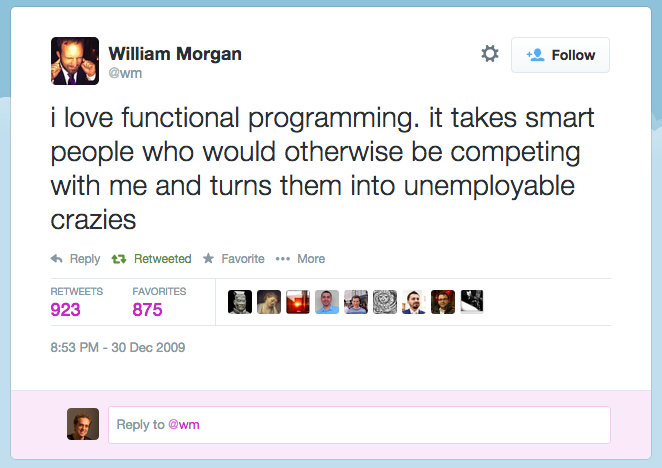

.notes landslide presentation.md --linenos=inline -c -r -w

# ClojureScript and React
October 16th 2014

## Michiel Borkent

[@borkdude](https://www.twitter.com/borkdude)

## Vijay Kiran

[@vijaykiran](https://www.twitter.com/vijaykiran)

---
# Schedule

* Intro
* Clojure(Script) crash course
* Reagent
* Om

---
# Clojure

---
# Warning

---
# Poll

* Who here has heard about Clojure(Script)?
* Who here can program (a little bit) in Clojure(Script)?
* Crash course?

---
# Clojure crash course

---
# Clojure crash course

# REPL
- Interactive development: Read Eval Print Loop

		!clojure
		user=>                         <- prompt

- Start one by `lein repl`
  or in IntelliJ

---
# Clojure crash course

In the REPL we will cover the following basics:

* Clojure basics and special forms
    - if
    - let
    - function call
    - function definition

---
# Clojure crash course

# If

    !clojure
    (if (< (rand-int 10) 5)
      "Smaller than 5"
      "Greater or equal than 5")

---
# Clojure crash course

# Let
    !clojure
    (let [x (+ 1 2 3)
          y (+ 4 5 6)
          z (+ x y)]
      z) ;;=> 21

---
# Clojure crash course

# Function call

    !clojure
    (inc 1) ;;=> 2

instead of

    !javascript
    inc(1) // 2

It is called prefix notation

---
# Clojure crash course

# Function definition
    !clojure
    (def my-fun (fn [x]
                  (+ x 2)))

    ;; same as:
    (defn my-fun [x]
      (+ x 2))

---
# Clojure crash course

Literals, symbols and keywords

    !clojure
    1     ;; integer literal
    "foo" ;; string literal
    'foo  ;; quoted symbol
    foo   ;; symbol (will evaluate to value bound to foo)
    :foo  ;; keyword, more or less a constant, often used as key in hashmap
    {:a 1, :b 2} ;; map literal

---
# Clojure crash course

* Clojure collections
    - vectors
    - maps
    - lists
    - sets

* Functions on data structures

---
# Clojure crash course

Vectors

    !clojure
    (def v1 (vector 1 2 3 4))
    (def v2 [1 2 3 4])
    (= v1 v2) ;; true
    (get v1 0) ;; 1
    (get v1 3) ;; 4
    (get v1 4) ;; nil
    (v1 0) ;; 1
    (v1 3) ;; 4
    (conj v1 5) ;; [1 2 3 4 5]

---
# Clojure crash course

Maps

    !clojure
    (def m1 {:a 1 :b 2})
    (get m1 :a) ;; 1
    (get m1 :b) ;; 2
    (m1 :a) ;; 1
    (:a m1) ;; 1
    (:c m1) ;; nil
    (assoc m1 :c 3) ;; {:c 3, :b 2, :a 1}

---
# Clojure crash course

Lists.
Used mostly for representing code (for example in macros).

    !clojure
    (def expr (list 'println 1 2 3)) ;; (println 1 2 3), unevaluated
    (eval expr) ;; prints 1 2 3, normally we don't do this
    (conj (list 1 2 3) 4) ;; (4 1 2 3)

---
# Clojure crash course

Sets

    !clojure
    (def s1 #{1 2 3})
    (contains? s1 1) ;;=> true
    (contains? s1 4) ;;=> false
    (conj s1 4) ;;=> #{1 2 3 4}
    (disj s1 3) ;;=> #{1 2}

---
# Sequence abstraction

Clojure collections implement a sequence interface, so you can apply general sequences functions.

Examples: `first`, `rest`, `map`, `filter`, `remove`.

    !clojure
    (def v1 [1 2 3 4])
    (first v1) ;; 1
    (rest v1) ;; (2 3 4)
    (map inc v1) ;; (2 3 4 5)
    (filter odd? v1) ;; (1 3)
    (remove odd? v1) ;; (2 4)

---
# Mutable state

Atoms are mutable references to immutable values.

One of 4 kinds of mutable references in Clojure.

(the others: `vars`, `refs` and `agents`)

    !clojure
    (def my-atom (atom 1)) ;; atom with long in it
    (deref my-atom) ;; 1
    @my-atom ;; same, 1
    (reset! my-atom 2)
    @my-atom ;; now atom contains 2
    (doseq [i (range 100)]
      (future (reset! my-atom (inc @my-atom))))
    @my-atom ;; 95, OMG, WHY!!!

---
# Mutable state

Atoms are atomically updated only via `swap!`

* `swap!` takes a function of one or more arguments
* the function receives the old value of the atom as the first argument

.

    !clojure
    (def my-atom (atom 1))
    (swap! my-atom (fn [old-value]
                     (inc old-value)))
    (swap! my-atom inc) ;; same
    @my-atom ;; 3, inc-ed two times so far
    (doseq [i (range 100)]
      (future (reset! my-atom (inc @my-atom))))
    @my-atom ;; 103, that's better

---

# Mutable state

More involved example

    !clojure
    (def game-state (atom {:player-1 {:score 0}
                           :player-2 {:score 0}}))

    (defn increase-score [old-state player points]
      (update-in old-state [player :score] + points))

    ;; test:
    (increase-score {:player-1 {:score 0}
                     :player-2 {:score 0}}
                    :player-1
                    20)
    ;; => {:player-2 {:score 0}, :player-1 {:score 20}}

    (swap! game-state increase-score :player-1 10)
    (swap! game-state increase-score :player-2 20)
    @game-state ;; {:player-2 {:score 20}, :player-1 {:score 10}}
---
# User interface

---
# User interface

* Clojurescript
    - Clojure compiled to javascript
* React
    - V of MVC
    - Component based
    - Components can have props and inner state
    - Virtual DOM

* ClojureScript abstractions
    - Om
    - Reagent

---
# ClojureScript abstractions

## Om
* Opinionated library by David Nolen
* App-state based on one atom
* Cursor based access (kind of a functional lens / zipper)
* Components can access shared state, app state or local state
* Communication between components via app-state, handlers or core.async
* Explicit hooks to React lifecycle
* Follows React semantics closely (e.g. local state changes cause re-rendering)

See [examples](https://github.com/swannodette/om/tree/master/examples)

---
# ClojureScript abstractions

## Reagent
* Minimalistic ClojureScript interface to React
* State is saved in RAtom, like clojure.core/atom, but keeps track of derefs
* Components can deref RAtom and will be re-rendered when RAtom changes
* Less verbose than Om
* You can hook to React lifecycle, but often don't need to

See [examples](http://holmsand.github.io/reagent/)

---
# (thanks!)
